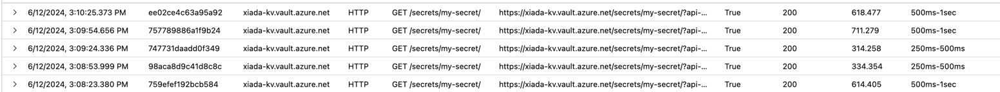

This project is to help debug the span missing issue of Spring Cloud Azure Starter for Key Vault Secrets. Application 
Insights provide a java agent to collect logs, metrics, and tracing, and then send them to Azure Application Insights.

The reported issue is that the requests sent to Key Vault Secrets are not captured by Application Insights. And the issue 
happens in spring-cloud-azure-starter:4.17.0, and is fixed by upgrading to 4.18.0. 

## Try to reproduce the issue

A minimal project to try to reproduce the issue needs to be created. This project uses the same version as the reported 
issue, and they are `org.springframework.boot:2.7.18`, `com.azure.spring:spring-cloud-azure-dependencies:4.17.0`. It configures 
the Key Vault property source, and then reads a secret from Key Vault. Since the start-up time is very short, and the requests 
sent from the Key Vault property source are not many, so a while loop is added into this application, to periodically read
secrets from Key Vault.

An application insights instance is created in Azure, and the instrumentation key is added to the environment variable, 
by key `APPLICATIONINSIGHTS_CONNECTION_STRING`. Another configuration is needed to show more detailed logs of Application
Insights, setting `APPLICATIONINSIGHTS_SELF_DIAGNOSTICS_LEVEL` to `debug` or `trace`.

First, change the `springCloudAzureVersion` in `build.gradle` to `4.18.0`, to see whether there are tracing sent to AI.
The information can be found via querying logs in Application Insights using the following query:

```kql
// average dependency duration by target
let start=datetime("2024-06-12T05:29:00.000Z");
let end=datetime("2024-06-12T07:29:00.000Z");
let timeGrain=1m;
let dataset=dependencies
    // additional filters can be applied here
    | where timestamp > start and timestamp < end
    | where client_Type != "Browser"
    | where ((itemType == "dependency" and columnifexists("target", itemType) has "xiada-kv.vault.azure.net") 
        or ((itemType == "request" and columnifexists("id", operation_ParentId) in ((dependencies 
        | where timestamp > start and timestamp < end
        | where columnifexists("target", itemType) has "xiada-kv.vault.azure.net" 
        | project operation_ParentId)))
        or (itemType != "request" and itemType != "dependency" and operation_ParentId in ((dependencies 
        | where timestamp > start and timestamp < end
        | where columnifexists("target", itemType) has "xiada-kv.vault.azure.net" 
        | project operation_ParentId)))));// select a filtered set of dependencies and calculate average duration by target
dataset
| where ((iff(tolower(type) == "http (tracked component)", "HTTP", type) == "HTTP" and tostring(split(target, " | cid-v1")[0]) == "xiada-kv.vault.azure.net"))
```

And the result are like: 



And then change the `springCloudAzureVersion` in `build.gradle` to `4.17.0`, and run the application again. Fortunately,
there are no logs in Application Insights, which means the issue has been reproduced. And one more finding is that both 
the requests made in the Spring KV property source, and the requests made in the while loop, sent directly by the sdk client,
are not captured by Application Insights, so this is more like a global issue, not only related to the Spring Cloud Azure. 

## Try to debug the issue

The Application Insights is a java agent, so it's difficult to debug the issue directly in Intellij. And the java agent 
has a lot of shadowed dependencies, as well as `.classdata` obfuscation. After several tries, including run the application 
as a smoke test in the [Application Insights Java](https://github.com/microsoft/ApplicationInsights-Java) project and debugging
this project directly, remote debugging is proved to be the most effective way to debug the issue.

The following steps are needed to debug the issue:

1.Build this project and then run the application:
> Make sure this line is commented out in the build.gradle `implementation(files('libs/javaagentLibs-relocated.jar'))`
```bash
./gradlew clean bootJar
java -javaagent:/path-to/applicationinsights-agent-3.4.19-SNAPSHOT.jar -jar -agentlib:jdwp="transport=dt_socket,server=y,suspend=y,address=5005" build/libs/demo-applicationinsights-0.0.1-SNAPSHOT.jar
```
2.Create a `Remote JVM Debug` in Intellij, uncomment the javaagent line in the build.gradle, and then debug the remote debug. 
The application will wait for the remote debug to connect, and then the application will start. 

```console
Listening for transport dt_socket at address: 5005
```
The reason to comment out the javaagent line in the first step is to avoid adding it to the application's runtime classpath. 
But for the second step, we need to use it, because this jar is not obfuscated, and we can set breakpoints in it. The two jars
can be retrieved by:
- Clone the [Application Insights Java](https://github.com/microsoft/ApplicationInsights-Java) project.
- Run `./gradlew assemble`. More information can be found [here](https://github.com/microsoft/ApplicationInsights-Java/blob/main/CONTRIBUTING.md).

## Try to identify the issue

Even though the application can be debugged now, but lacking the knowledge of how azure-core, azure http sdks, application
insights java agent, and open-telemetry work together, it's still difficult to identify the issue. But clues can be found by comparing 
the logs of the two versions.

The span information collected from 4.17.0 has only one span related to the Key Vault, as following:

```console
SpanData{
    spanContext=ImmutableSpanContext{
        traceId=720173d085fd2014777258873f7509d7, spanId=3df06886c1f2f5da, traceFlags=01, traceState=ArrayBasedTraceState{entries=[]}, remote=false, valid=true
    }, 
    parentSpanContext=ImmutableSpanContext{
        traceId=00000000000000000000000000000000, spanId=0000000000000000, traceFlags=00, traceState=ArrayBasedTraceState{entries=[]}, remote=false, valid=false
    }, 
    resource=Resource{schemaUrl=null, attributes={service.name="unknown_service:java", telemetry.sdk.language="java", telemetry.sdk.name="opentelemetry", telemetry.sdk.version="1.32.0"}}, 
    instrumentationScopeInfo=InstrumentationScopeInfo{
        name=azure-security-keyvault-secrets, version=4.8.1, schemaUrl=https://opentelemetry.io/schemas/1.17.0, attributes={}
    }, 
    name=SecretClient.getSecretSync, 
    kind=INTERNAL, 
    startEpochNanos=1718195165882422000, 
    endEpochNanos=1718195232784557667, 
    attributes=AttributesMap{
        data={applicationinsights.internal.item_count=1, thread.id=1, thread.name=main, az.namespace=Microsoft.KeyVault}, 
        capacity=128, 
        totalAddedValues=4
    }, 
    totalAttributeCount=4, 
    events=[], 
    totalRecordedEvents=0, 
    links=[], 
    totalRecordedLinks=0, 
    status=ImmutableStatusData{statusCode=UNSET, description=}, 
    hasEnded=true
}
```

But in version 4.18.0, there are more spans related to the Key Vault linked together, as following:

```console
SpanData{
    spanContext=ImmutableSpanContext{traceId=ee8c71c31e5abfc10234327676114d5f, spanId=7449a5acb627b60b, traceFlags=01, traceState=ArrayBasedTraceState{entries=[]}, remote=false, valid=true}, 
    parentSpanContext=ImmutableSpanContext{traceId=00000000000000000000000000000000, spanId=0000000000000000, traceFlags=00, traceState=ArrayBasedTraceState{entries=[]}, remote=false, valid=false}, 
    resource=Resource{schemaUrl=null, attributes={service.name="unknown_service:java", telemetry.sdk.language="java", telemetry.sdk.name="opentelemetry", telemetry.sdk.version="1.32.0"}}, 
    instrumentationScopeInfo=InstrumentationScopeInfo{
        name=azure-security-keyvault-secrets, version=4.8.2, schemaUrl=https://opentelemetry.io/schemas/1.17.0, attributes={}
    }, 
    name=SecretClient.getSecretsSync, 
    kind=INTERNAL, 
    startEpochNanos=1718174796984700000, 
    endEpochNanos=1718174802396696708, 
    attributes=AttributesMap{
        data={az.namespace=Microsoft.KeyVault, thread.id=1, applicationinsights.internal.item_count=1, thread.name=main}, 
        capacity=128, 
        totalAddedValues=4
    }, 
    totalAttributeCount=4, 
    events=[], 
    totalRecordedEvents=0, 
    links=[], 
    totalRecordedLinks=0, 
    status=ImmutableStatusData{statusCode=UNSET, description=}, 
    hasEnded=true
}
SpanData{
    spanContext=ImmutableSpanContext{traceId=ee8c71c31e5abfc10234327676114d5f, spanId=0e03c1d7de71d010, traceFlags=01, traceState=ArrayBasedTraceState{entries=[]}, remote=false, valid=true}, 
    parentSpanContext=ImmutableSpanContext{traceId=ee8c71c31e5abfc10234327676114d5f, spanId=7449a5acb627b60b, traceFlags=01, traceState=ArrayBasedTraceState{entries=[]}, remote=false, valid=true}, 
    resource=Resource{schemaUrl=null, attributes={service.name="unknown_service:java", telemetry.sdk.language="java", telemetry.sdk.name="opentelemetry", telemetry.sdk.version="1.32.0"}}, 
    instrumentationScopeInfo=InstrumentationScopeInfo{
        name=io.opentelemetry.http-url-connection, version=1.32.0-alpha, schemaUrl=null, attributes={}
    }, 
    name=GET, 
    kind=CLIENT, 
    startEpochNanos=1718174798540320291, 
    endEpochNanos=1718174800553277833, 
    attributes=AttributesMap{
        data={thread.id=51, net.peer.name=169.254.169.254, applicationinsights.internal.item_count=1, http.method=GET, thread.name=ForkJoinPool.commonPool-worker-1, net.protocol.version=1.1, http.url=http://169.254.169.254/metadata/identity/oauth2/token?api-version=2018-02-01, applicationinsights.internal.operation_name=SecretClient.getSecretsSync, applicationinsights.internal.is_pre_aggregated=true, net.protocol.name=http}, 
        capacity=128, 
        totalAddedValues=10
    }, 
    totalAttributeCount=10, 
    events=[ImmutableExceptionEventData{epochNanos=1718174799547062416, exception=java.net.SocketTimeoutException: Connect timed out, additionalAttributes={}, spanLimits=SpanLimitsValue{maxNumberOfAttributes=128, maxNumberOfEvents=128, maxNumberOfLinks=128, maxNumberOfAttributesPerEvent=128, maxNumberOfAttributesPerLink=128, maxAttributeValueLength=2147483647}}], totalRecordedEvents=1, links=[], totalRecordedLinks=0, 
    status=ImmutableStatusData{statusCode=ERROR, description=}, 
    hasEnded=true
}
SpanData{
    spanContext=ImmutableSpanContext{traceId=ee8c71c31e5abfc10234327676114d5f, spanId=157a3ca40a494ef0, traceFlags=01, traceState=ArrayBasedTraceState{entries=[]}, remote=false, valid=true}, 
    parentSpanContext=ImmutableSpanContext{
        traceId=ee8c71c31e5abfc10234327676114d5f, 
        spanId=7449a5acb627b60b, 
        traceFlags=01, traceState=ArrayBasedTraceState{entries=[]}, remote=false, valid=true
    }, 
    resource=Resource{schemaUrl=null, attributes={service.name="unknown_service:java", telemetry.sdk.language="java", telemetry.sdk.name="opentelemetry", telemetry.sdk.version="1.32.0"}}, 
    instrumentationScopeInfo=InstrumentationScopeInfo{
        name=azure-security-keyvault-secrets, version=4.8.2, schemaUrl=https://opentelemetry.io/schemas/1.17.0, attributes={}
    }, 
    name=GET, 
    kind=CLIENT, 
    startEpochNanos=1718174801959292541, 
    endEpochNanos=1718174802384774916, 
    attributes=AttributesMap{
        data={az.namespace=Microsoft.KeyVault, http.request.resend_count=1, thread.id=1, applicationinsights.internal.item_count=1, server.address=xiada-kv.vault.azure.net, server.port=443, http.method=GET, thread.name=main, az.service_request_id=1f0cb760-bcf9-447f-836a-8d28d3a24992, http.url=https://xiada-kv.vault.azure.net/secrets?api-version=7.5, http.status_code=200, applicationinsights.internal.operation_name=SecretClient.getSecretsSync}, 
        capacity=128, 
        totalAddedValues=12
    }, 
    totalAttributeCount=12, 
    events=[], 
    totalRecordedEvents=0, 
    links=[], 
    totalRecordedLinks=0, 
    status=ImmutableStatusData{statusCode=UNSET, description=}, 
    hasEnded=true
}
```

From the comparison, break points could be added to `SpanContext` or `InstrumentationScopeInfo`, and from the call stack 
a trace of the java method calls can be found as:
1. SyncRestProxy:startTracingSpan
2. Tracer:start // the implementation is [OpenTelemetryTracer](https://github.com/Azure/azure-sdk-for-java/blob/main/sdk/core/azure-core-tracing-opentelemetry/src/main/java/com/azure/core/tracing/opentelemetry/OpenTelemetryTracer.java)

For several http calls executed in the same context, previous http call will set the parent span for the next http call via
the parent context key. And the following calls will try to retrieve the parent span from the context.


## Possible root cause
After debugging the issue, the guessing of the issue could be:
- In version azure-core:1.47.0 (included in Spring Cloud Azure 4.17.0): 
  - the key used to set the parent context is [Tracer.PARENT_TRACE_CONTEXT_KEY](https://github.com/Azure/azure-sdk-for-java/blob/955e1ff40755d7f9b0e7aac34df475b969f167b0/sdk/core/azure-core-tracing-opentelemetry/src/main/java/com/azure/core/tracing/opentelemetry/OpenTelemetryTracer.java#L161)
  - the key to retrieve the parent context is [TRACING_CONTEXT](https://github.com/Azure/azure-sdk-for-java/blob/1225fe317d3fe2ba2a71e9130983d93e65d7ab35/sdk/core/azure-core/src/main/java/com/azure/core/implementation/http/rest/RestProxyBase.java#L230), via [SyncRestProxy:startTracingSpan](https://github.com/Azure/azure-sdk-for-java/blob/1225fe317d3fe2ba2a71e9130983d93e65d7ab35/sdk/core/azure-core/src/main/java/com/azure/core/implementation/http/rest/SyncRestProxy.java#L63)
- In version azure-core:1.48.0 (included in Spring Cloud Azure 4.18.0):
  - the key used to set the parent context is the same as above
  - the key used to retrieve the parent context is [Tracer.PARENT_TRACE_CONTEXT_KEY](https://github.com/Azure/azure-sdk-for-java/blob/da095907098d35578a21b38530556591180944ea/sdk/core/azure-core/src/main/java/com/azure/core/implementation/http/rest/RestProxyBase.java#L227).

But since the issue didn't happen in the version Spring Cloud Azure 4.16.0, with azure-core:1.46.0, so the root cause still needs to be identified.

## The actual root cause

Even though the parent context is also a problem, but the actual root cause of this issue is (with the help of the author):

- A regression introduced in https://github.com/Azure/azure-sdk-for-java/pull/38013 in azure-core 1.46.0 (released in Feb 2024)
- It was fixed in https://github.com/Azure/azure-sdk-for-java/pull/39381 in azure-core 1.48.0 (released in April 2024)

And the analysis is:

- Azure-core changed the behavior on when to end HTTP span (such as "HTTP GET https://xxx.vault.azure.net/secrets?api-version=7.4"). As a result of this change, the span was reported when response was closed, failed, or was cancelled.
- In many cases response does not have to be closed, it just needs to be read to the last byte. In these cases, azure-core did not close the HTTP span resulting in missing dependencies in Application Insights.
 


  

